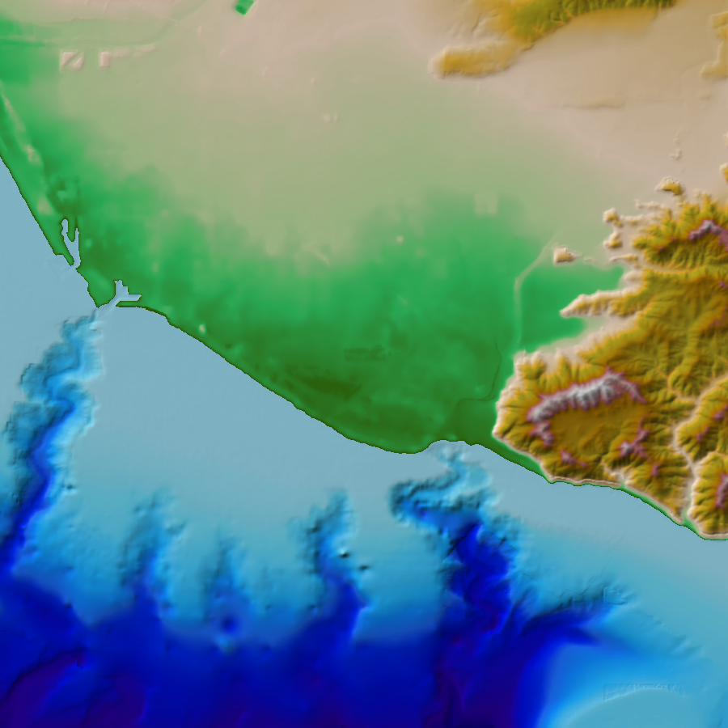

Matthew Love[^1][^2], Christopher Amante[^1][^2]

[^1]: Cooperative Institute for Research in Environmental Sciences (CIRES)
at the University of Colorado Boulder

[^2]: National Oceanic and Atmospheric Administration (NOAA) National
Centers for Environmental Information (NCEI)

# Overview

The National Oceanic and Atmospheric Administration (NOAA) National
Centers for Environmental Information (NCEI), through its collaboration
with the Cooperative Institute for Research in Environmental Sciences
(CIRES) at the University of Colorado Boulder, develops digital
elevation models (DEMs) that range from the local to global scale.
Collectively, these elevation models are essential to determining the
timing and extent of coastal inundation and improving community
preparedness, event forecasting, and warning systems. We initiated a
comprehensive framework at NCEI, the Continuously-Updated DEM (CUDEM)
Program, to systematically generate DEMs from the local coastal
community to the global scale.

We generate the CUDEMs through a standardized process using free and
open-source software (FOSS) and provide open-access to our code
repository
([https://github.com/ciresdem](https://github.com/ciresdem)) for
consistency, transparency, and to promote accessibility. The CUDEM
framework consists of systematic tiled geographic extents, spatial
resolutions, and horizontal and vertical datums to facilitate rapid
updates of targeted areas with new data collections, especially
post-storm and tsunami events. The CUDEM Program is also enabling the
rapid incorporation of high-resolution data collections ingested into
local-scale DEMs into NOAA NCEI's suite of regional and global DEMs. The
CUDEMs are a shift from project-based DEM specifications, to a
comprehensive program that systematically and continuously develops and
updates DEMs across all spatial scales.

# Installation and Setup

## pip
GDAL and GDAL-Python are required for use.

Other useful external programs needed for full functionality include:
GMT, MB-System, HTDP and VDatum.

Download and install git (If you have not already): [git installation](https://git-scm.com/book/en/v2/Getting-Started-Installing-Git)

```
pip install git+https://github.com/ciresdem/cudem.git#egg=cudem
```

## conda
- Setup a conda environment and isntall the dependencies:

```
conda install -c conda-forge gdal gmt numpy scipy pandas pyproj utm requests lxml matplotlib laspy h5py boto3 tqdm mercantile
```

- install HTDP and MB-System

System dependent

- Install cudem with pip ignoring the dependencies

```
pip install --no-deps git+https://github.com/ciresdem/cudem.git
```

**Main Console Programs provided with CUDEM:**

| Command | Description |
|---|---|
| dlim | process data from a variety of data types |
| waffles | generate Digital Elevation Models from scattered data using a variety of methods|
| regions | process REGIONS |
| fetches | fetch elevation data from a variety of public online sources |
| vdatums | generate vertical transformation grids |
| perspecto | generate images of DEMs |
| cudem   | run CUDEM cli programs and scripts |

# Usage: Data Download, Processing, and DEM Generation

The open-access code includes command-line tools and a Python
application programming interface (API) for automated data download,
processing, DEM gridding, and interpolation uncertainty grid generation
with three main software tools: "fetches", "waffles", and "dlim".
"Fetches" is the data download tool for obtaining publicly available
elevation data froma variety of sources and can optionally list, download or
process thefetched data for use in DEM generation. We download a variety of
data types, e.g., topographic-bathymetry lidar, multibeam swath sonar
bathymetry, hydrographic soundings, compiled grids, etc., from a variety
of sources, e.g., NOAA Office for Coastal Management (OCM) Digital
Coast, NOAA NCEI NOS Hydro Surveys, NOAA NCEI Multibeam, USGS The
National Map, and U.S. Army Corps of Engineers (USACE) Navigation
Condition Surveys. Other data sources include digitized bathymetric
charts or topographic maps, shorelines, satellite-derived elevations,
and precisely surveyed geodetic monuments (Table 1). We typically
download data in an area slightly larger (\~5%) than the DEM extents.
This data "buffer" ensures that interpolative gridding occurs across
rather than along the DEM boundaries to prevent edge effects, which is
especially important with sparse bathymetric data with large
interpolation distances. Data buffers also minimize artificial offsets
between adjacent DEM tiles.

**Table 1.** Data source modules available in the CUDEM software tool
"fetches*.*"

| ***Name***            | ***Description***     | ***URL***             |
|---|---|---|
| arcticdem | Arctic DEM | https://www.pgc.umn.edu/data/arcticdem/ |
| bluetopo | A curated collection of high resolution seafloor models from NOAA. | https://www.nauticalcharts.noaa.gov/data/bluetopo.html |
| buoys | Buoy information from NOAA | https://www.ndbc.noaa.gov |
| charts | NOS Nautical Charts, including electronic Nautical Charts and Raster Nautical Charts | https://www.charts.noaa.gov/ |
| chs | Canadian Hydrographic Surveys | https://open.canada.ca |
| copernicus | Copernicus elevation data | https://ec.europa.eu/eurostat/web/gisco/geodata/reference-data/elevation/copernicus-dem/elevation |
| digital_coast | Lidar and Raster data from NOAA’s Digital Coast | https://coast.noaa.gov |
| earthdata | NASA Earthdata | https://cmr.earthdata.nasa.gov |
| ehydro | USACE hydrographic surveys | https://navigation.usace.army.mil/Survey/Hydro |
| emodnet | EmodNET European Bathymetric/Topographic DEM | https://portal.emodnet-bathymetry.eu/ |
| fabdem | FABDEM  (Forest And Buildings removed Copernicus DEM) | https://data.bris.ac.uk/data/dataset/s5hqmjcdj8yo2ibzi9b4ew3sn |
| gebco | A global continuous terrain model for ocean and land with a spatial resolution of 15 arc seconds. | https://www.gebco.net/data_and_products/gridded_bathymetry_data/ |
| gmrt | The Global MultiResolution Topography synthesis | https://www.gmrt.org |
| hrdem | High-Resolution DEMs from Canada | https://open.canada.ca |
| hydrolakes | HydroLakes vector and derived elevations | https://www.hydrosheds.org/products/hydrolakes |
| mar_grav | Marine Gravity Satellite Altimetry Topography from Scripps. | https://topex.ucsd.edu/WWW_html/mar_grav.html |
| mgds | Marine Geoscience Data System | https://www.marine-geo.org |
| multibeam | NOAA Multibeam bathymetric data | https://data.ngdc.noaa.gov/platforms/ |
| nasadem | NASA Digital Elevation Model | https://www.earthdata.nasa.gov/esds/competitive-programs/measures/nasadem |
| ncei_thredds | NCEI DEM THREDDS Catalog | https://www.ngdc.noaa.gov/thredds/demCatalog.xml |
| ngs | NGS monuments | http://geodesy.noaa.gov/ |
| nos | NOS Hydrographic DataBase (NOSHDB) | https://www.ngdc.noaa.gov/mgg/bathymetry/hydro.html |
| osm | Open Street Map | https://wiki.openstreetmap.org/ |
| srtm_plus | SRTM15+: Global bathymetry and topography at 15 arc-seconds. | https://topex.ucsd.edu/WWW_html/srtm15_plus.html |
| tides | Tide station information from NOAA | https://tidesandcurrents.noaa.gov/ |
| tnm | USGS National Map | http://tnmaccess.nationalmap.gov/ |
| trackline | NOAA trackline bathymetry data | http://www.ngdc.noaa.gov/trackline/ |
| usiei | US Interagency Elevation Inventory | https://coast.noaa.gov/inventory/ |
| wsf | World Settlement Footprint from DLR (German Aerospace Center) | https://download.geoservice.dlr.de/WSF2019/ |
| vdatum | Vertical Datum transformation grids | https://vdatum.noaa.gov https://cdn.proj.org/ |
| icesat | IceSat2 granules from NASA (requires NASA credentials) | https://cmr.earthdata.nasa.gov |


"Waffles" is the data gridding tool for DEM generation using various
gridding modules (Table 2). We leverage existing open-source software
packages from a variety of sources including GMT, GDAL, and MB-System.
From these sources, there are also multiple gridding algorithms, e.g.,
spline, inverse distance weighting (IDW), triangulate, average,
near-neighbor, etc. Previous research at NOAA NCEI indicates spline
interpolation is the most accurate gridding algorithm for generating
DEMs (Amante and Eakins, 2016). However, the measurement density and
terrain characteristics (e.g. terrain slope and curvature) may influence
the accuracy of the various gridding algorithms and multiple algorithms
should be evaluated. We then generate DEMs by a combination of data
masking, weighting, and interpolation.

**Table 2.** Gridding modules available in the CUDEM software tool
"waffles."

|  ***Name***          |                ***Description*** |
|----------------------|----------------------------------|
|  gdal-average        |                Generate an average DEM using GDAL\'s *gdal_grid* command. |
|  coastline           |                Generate a coastline (land/sea mask) using a variety of data sources. |
|  cudem               |                CUDEM integrated DEM generation. Generate an topographic-bathymetric integrated DEM using a variety of data sources. |
|  IDW                 |                Generate a DEM using an Inverse Distance Weighted algorithm. If weights are used, will generate a UIDW DEM, using weight values as inverse uncertainty, as described [here](https://ir.library.oregonstate.edu/concern/graduate_projects/79407x932), and [here](https://stackoverflow.com/questions/3104781/inverse-distance-weighted-idw-interpolation-with-python) |
|  gdal-invdst         |                Generate an inverse distance DEM using GDAL\'s *gdal_grid* command. |
|  gdal-linear         |                Generate a linear DEM using GDAL\'s *gdal_grid* command. |
|  mbgrid              |                Generate a DEM using MB-System\'s *mbgrid* command. |
|  gdal-nearest        |                Generate a nearest DEM using GDAL\'s *gdal_grid* command. |
|  gmt-nearneighbor    |                Generate a DEM using GMT\'s *nearneighbor* command |
|  num                 |                Generate an uninterpolated DEM using various gridding modes, including options from GMT's *xyz2grd* command. |
|  linear               |               Generate a DEM using Scipy's linear gridding algorithm) |
|  cubic               |                Generate a DEM using Scipy's cubic gridding algorithm |
|  nearest              |               Generate a DEM using Scipy's nearest gridding algorithm |
|  stacks              |                Generate a DEM using a raster stacking method. By default, calculate the \[weighted\]-mean where overlapping cells occur. Set supercede to True to overwrite overlapping cells with higher weighted data. | 
|  gmt-surface         |               Generate a DEM using GMT\'s *surface* command | 
|  gmt-triangulate     |               Generate a DEM using GMT\'s *triangulate* command | 
|  vdatum              |                Generate a vertical datum conversion grid. |
|  flatten              |               Generate a DEM by flattening nodata areas. |
|  lakes              |               Estimate/interpolate Lake bathymetry. |
|  uncertainty         |               Estimate interpolation uncertainty. |

# Uncertainty Grid Generation

We generate uncertainty grids that represent an estimate of potential
interpolation errors based on a split-sample approach and distance to
the nearest measurement. Using a split-sample approach, a percentage of
the data is omitted, an interpolation method is applied, and the
differences between the interpolated elevations and the original omitted
elevations are calculated. We omit a percentage of the measurements,
apply an interpolation method, and calculate the differences between the
interpolated values and the omitted elevations. We repeat this process
and aggregate the differences between the original measurements and the
interpolated elevations and then we derive a best-fit equation of
interpolation uncertainty as a function of distance to the nearest
measurement.

# Spatial Metadata

We generate spatial metadata for our DEMs that document the data sources
that went into the DEM generation process.

# Examples

## Coarse Coastal Releif Model (CRM) at 1 arc-second DEM off the coast of Malibu

Generate a CRM of the Point Mugu area of Malibu using remote datalists provided from fetches.
Datasets included in this example are Marine Gravity (mar_grav), Nautical Charts (charts),
NOS Soundings (hydronos:datatype=xyz), Copernicus (copernicus), USACE surveys (ehydro) and
NOS BAG surveys (hydronos:datatype=bag)

```
waffles -R -119.25/-119/34/34.25 -E 1s -M cudem:pre_count=1:filter_outliers=85:min_weight=.6 -O mugu_crm_test -P epsg:4326+5703 -w -X0:5 mar_grav,-106:bathy_only=True,.001 charts,-200,.01 hydronos:datatype=xyz,-202,.1 copernicus,-103,.6 ehydro,-203,.6 hydronos:datatype=bag,-202,.75
```

Generate a hillshade of the generated DEM:

```
perspecto -M hillshade mugu_crm_test.tif
```


**Figure 1.** DEM hillshade generated from CUDEM code example.

## DEM and Uncertainty for the Bahamas

We provide an example of code to download and process depth and
elevation data from the "gebco", "copernicus", and "mar_grav" data
sources in Table 1, and then generate a DEM and accompanying
interpolation uncertainty grid. First, we download all the data, and
then process the data by masking out GEBCO data where TID is equal to 0
(Land) or 40 (Predicted based on satellite-derived gravity data - depth
value is an interpolated value guided by satellite-derived gravity
data). See the GEBCO Cookbook chapter on GEBCO TID generation for more
information.

We then stack the raster data sources with higher weighted datasets
masking out lower weighted datasets and apply spline interpolation to
the bathymetry by limiting the interpolation to an upper limit value of
zero and clipping the resulting grid to an automatically generated
coastline from the Copernicus data.

Lastly, we combine this bathymetric surface with the other data sources
that have a weighting above the min_weight specification (in this
example, min_weight=.15), and apply spline interpolation with a weighted
averages of these data sources to generate the final integrated
bathymetric-topographic DEM.

**To generate the configuration file that is then used to generate the
15 arc-second resolution DEM and the interpolation uncertainty grid,
execute the following command:**

```
waffles -R -79.5/-76.5/25/28 -E 15s -O gebcop -p -w -m -P epsg:4326 -M cudem:min_weight=.15:landmask=True:pre_count=1 gebco,-102:exclude_tid=0/40,.015 copernicus,-103,10 mar_grav,-106:bathy_only=True,.001 gmrt,-101:swath_only=True,1.5 --config
```

The contents of the generated config file configuration file
(gebcop15_n28x00_w079x50_2023v1.json) are as follows:

```
{
    "mod": "cudem:min_weight=.15:landmask=True:pre_count=1",
    "mod_name": "cudem",
    "mod_args": {
        "min_weight": ".15",
        "landmask": true,
        "pre_count": "1"
    },
    "kwargs": {
        "verbose": true,
        "sample": "bilinear",
        "xsample": null,
        "ysample": null,
        "dst_srs": "epsg:4326",
        "srs_transform": false,
        "fltr": [],
        "name": "gebcop15_n28x00_w079x50_2023v1",
        "cache_dir": "/home/ncei/Projects/crm/software/.cudem_cache",
        "ndv": -9999,
        "xinc": 0.004166666666666667,
        "yinc": 0.004166666666666667,
        "want_weight": true,
        "want_mask": true,
        "data": [
            "gebco,-102:exclude_tid=0/40,.015,0",
            "copernicus,-103,10,0",
            "mar_grav,-106:bathy_only=True,.001,0",
            "gmrt,-101:swath_only=True,1.5,0"
        ],
        "src_region": [
            -79.5,
            -76.5,
            25.0,
            28.0
        ]
    }
}
```

**To generate the DEM, execute the following command:**

`waffles -G gebcop15_n28x00_w079x50_2023v1.json`

Output:

gebcop3_n28x00_w079x50_2023v1.json - json config file

gebcop3_n28x00_w079x50_2023v1_msk.tif - data mask

gebcop3_n28x00_w079x50_2023v1_stack.tif - stacks data \'stacked\'
output

gebcop3_n28x00_w079x50_2023v1_u.tif - uncertainty grid

gebcop3_n28x00_w079x50_2023v1.tif - final DEM


**Figure 1.** Final DEM generated from CUDEM code example.


**Figure 2.** Interpolation uncertainty grid generated from the best-fit
interpolation uncertainty equation applied to the distance to the
nearest measurement raster.

# Additional Information

The CUDEM code repository is frequently updated, and code syntax is
subject to change. Please see the code help function for the latest code
syntax and examples. See Eakins and Grothe (2014) for more information
on the challenges of building integrated DEMs and Eakins et al. (2015)
for the initial specifications of the comprehensive DEM development
framework. See Hare et al. (2011), Amante and Eakins (2016), and Amante
(2018) for additional information on the DEM uncertainty.

For additional questions, please contact:

[Matthew.Love@noaa.gov](mailto:Matthew.Love@noaa.gov)

[Christopher.Amante@noaa.gov](mailto:Christopher.Amante@noaa.gov)

## Code Syntax

### Fetches Module:
```
fetches (2.0.4): Fetches; Fetch and process remote elevation data

usage: fetches [ -hlqzHR [ args ] ] MODULE ...

Options:
  -R, --region		Restrict processing to the desired REGION 
			Where a REGION is xmin/xmax/ymin/ymax[/zmin/zmax[/wmin/wmax]]
			Use '-' to indicate no bounding range; e.g. -R -/-/-/-/-10/10/1/-
			OR an OGR-compatible vector file with regional polygons. 
			Where the REGION is /path/to/vector[:zmin/zmax[/wmin/wmax]].
			If a vector file is supplied, will use each region found therein.
  -H, --threads		Set the number of threads (1)
  -l, --list		Return a list of fetch URLs in the given region.
  -z, --no_check_size	Don't check the size of remote data if local data exists.
  -q, --quiet		Lower the verbosity to a quiet

  --modules		Display the module descriptions and usage
  --help		Print the usage text
  --version		Print the version information

Supported FETCHES modules (see fetches --modules <module-name> for more info): 
  gmrt, mar_grav, srtm_plus, charts, digital_coast, multibeam, gebco, mgds, trackline,
  ehydro, ngs, hydronos, ncei_thredds, tnm, emodnet, chs, hrdem, arcticdem, bluetopo,
  osm, copernicus, fabdem, nasadem, tides, vdatum, buoys, earthdata, usiei, wsf, hydrolakes,
  https, bing_bfp
```
### Dlim Module:
```
dlim (2.0.4): DataLists IMproved; Process and generate datalists

usage: dlim [ -acdghijquwEJPR [ args ] ] DATALIST,FORMAT,WEIGHT,UNCERTAINTY ...

Options:
  -R, --region		Restrict processing to the desired REGION 
			Where a REGION is xmin/xmax/ymin/ymax[/zmin/zmax[/wmin/wmax/umin/umax]]
			Use '-' to indicate no bounding range; e.g. -R -/-/-/-/-10/10/1/-/-/-
			OR an OGR-compatible vector file with regional polygons. 
			Where the REGION is /path/to/vector[:zmin/zmax[/wmin/wmax/umin/umax]].
			If a vector file is supplied, will use each region found therein.
  -E, --increment	Block data to INCREMENT in native units.
			Where INCREMENT is x-inc[/y-inc]
  -X, --extend		Number of cells with which to EXTEND the output DEM REGION and a 
			percentage to extend the processing REGION.
			Where EXTEND is dem-extend(cell-count)[:processing-extend(percentage)]
			e.g. -X6:10 to extend the DEM REGION by 6 cells and the processing region by 10 
			percent of the input REGION.
  -J, --s_srs		Set the SOURCE projection.
  -P, --t_srs		Set the TARGET projection. (REGION should be in target projection) 
  -D, --cache-dir	CACHE Directory for storing temp and output data.
  -Z, --z-precision	Set the target precision of dumped z values. (default is 4)

  --mask		MASK the datalist to the given REGION/INCREMENTs
  --spatial-metadata	Generate SPATIAL METADATA of the datalist to the given REGION/INCREMENTs
  --archive		ARCHIVE the datalist to the given REGION[/INCREMENTs]
  --glob		GLOB the datasets in the current directory to stdout
  --info		Generate and return an INFO dictionary of the dataset
  --weights		Output WEIGHT values along with xyz
  --uncertainties	Output UNCERTAINTY values along with xyz
  --quiet		Lower the verbosity to a quiet

  --modules		Display the datatype descriptions and usage
  --help		Print the usage text
  --version		Print the version information

Supported datalist formats (see dlim --modules <dataset-key> for more info):
  datalist (-1),  zip (-2),  scratch   (-3),  xyz (168),  gdal (200),  bag (201),  las (300),
  mbs (301),  ogr (302),  https (-100),  gmrt (-101),  gebco (-102),  copernicus (-103),
  fabdem (-104),  nasadem (-105),  mar_grav (-106),  srtm_plus (-107),  charts (-200),
  multibeam (-201),  hydronos (-202),  ehydro (-203),  bluetopo (-204),  ngs (-205),  tides (-206),
  digital_coast (-207),  ncei_thredds (-208),  tnm (-209),  emodnet (-300),  chs (-301),
  hrdem (-302),  arcticdem (-303),  vdatum (-500),  hydrolakes (-600)
```
### Waffles Module:
```
waffles (2.0.4): Generate DEMs and derivatives.

usage: waffles [OPTIONS] DATALIST

Options:
  -R, --region			Specifies the desired REGION;
				Where a REGION is xmin/xmax/ymin/ymax[/zmin/zmax[/wmin/wmax]]
				Use '-' to indicate no bounding range; e.g. -R -/-/-/-/-10/10/1/-
				OR an OGR-compatible vector file with regional polygons. 
				Where the REGION is /path/to/vector[:zmin/zmax[/wmin/wmax]].
				If a vector file is supplied, will use each region found therein.
  -E, --increment		Gridding INCREMENT and RESAMPLE-INCREMENT in native units.
				Where INCREMENT is x-inc[/y-inc][:sample-x-inc/sample-y-inc]
  -M, --module			Desired Waffles MODULE and options. (see available Modules below)
				Where MODULE is module[:mod_opt=mod_val[:mod_opt1=mod_val1[:...]]]
  -S, --sample_alg		ReSAMPLE algorithm to use (from gdalwarp)
				Set as 'auto' to use 'average' when down-sampling and 'bilinear' when up-sampling
				This switch controls resampling of input raster datasets as well as resampling
				the final DEM if RESAMPLE-INCREMENT is set in -E
  -X, --extend			Number of cells with which to EXTEND the output DEM REGION and a 
				percentage to extend the processing REGION.
				Where EXTEND is dem-extend(cell-count)[:processing-extend(percentage)]
				e.g. -X6:10 to extend the DEM REGION by 6 cells and the processing region by 10
				percent of the input REGION.
  -T, --filter			FILTER the output DEM using one or multiple filters. 
				Where FILTER is fltr_id[:fltr_val[:split_value=z]]
				Available FILTERS:
				1: perform a Gaussian Filter at -T1:<factor>.
				2: use a Cosine Arch Filter at -T2:<dist(km)> search distance.
				3: perform an Outlier Filter at -T3:<aggression<1-9>>.
				The -T switch may be set multiple times to perform multiple filters.
				Append :split_value=<num> to only filter values below z-value <num>.
				e.g. -T1:10:split_value=0 to smooth bathymetry (z<0) using Gaussian filter
  -L, --limits			LIMIT the output elevation or interpolation values, append 
				'u<value>' to set the upper elevation limit, 
				'l<value>' to set the lower elevation limit,
				'p<value>' to set an interpolation limit by proximity, or 
				's<value>' to set an interpolation limit by size.
				e.g. -Lu0 to set all values above 0 to zero, or 
				-Ls100 to limit interpolation to nodata zones smaller than 100 pixels.
  -C, --clip			CLIP the output to the clip polygon -C<clip_ply.shp:invert=False>
  -K, --chunk			Generate the DEM in CHUNKs.
  -F, --format			Output grid FORMAT. [GTiff]
  -O, --output-name		BASENAME for all outputs.
  -P, --t_srs			Projection of REGION and output DEM.
  -N, --nodata			The NODATA value of output DEM.
  -G, --wg-config		A waffles config JSON file. If supplied, will overwrite all other options.
				Generate a waffles_config JSON file using the --config flag.
  -H, --threads			Set the number of THREADS (1). Each input region will be run in up to THREADS threads. 
  -D, --cache-dir		CACHE Directory for storing temp data.
				Default Cache Directory is ~/.cudem_cache; cache will be cleared after a waffles session.
				to retain the data, use the --keep-cache flag.

  -f, --transform		Transform all data to PROJECTION value set with --t_srs/-P where applicable.
  -p, --prefix			Set BASENAME (-O) to PREFIX (append <RES>_nYYxYY_wXXxXX_<YEAR>v<VERSION> info to output BASENAME).
				note: Set Resolution, Year and Version by setting this to 'res=X:year=XXXX:version=X', 
				leave blank for default of <INCREMENT>, <CURRENT_YEAR> and <1>, respectively.
  -r, --grid-node		Use grid-node registration, default is pixel-node.
  -w, --want-weight		Use weights provided in the datalist to weight overlapping data.
  -u, --want-uncertainty	Generate/Use uncertainty either calculated or provided in the datalist.
  -m, --want-mask		Mask the processed datalist.
  -a, --archive			ARCHIVE the datalist to the given region.
  -k, --keep-cache		KEEP the cache data intact after run
  -x, --keep-auxiliary		KEEP the auxiliary rastesr intact after run (mask, uncertainty, weights, count).
  -d, --supercede		higher weighted data supercedes lower weighted data.
  -s, --spatial-metadata	Generate SPATIAL-METADATA.
  -c, --continue		Don't clobber existing files.
  -q, --quiet			Lower verbosity to a quiet.

  --help			Print the usage text
  --config			Save the waffles config JSON and major datalist
  --modules			Display the module descriptions and usage
  --version			Print the version information

Datalists and data formats:
  A datalist is a file that contains a number of datalist entries, 
  while an entry is a space-delineated line:
  `path [format weight uncertainty [name source date type resolution hdatum vdatum url]]`

Supported datalist formats: 
  datalist (-1),  zip (-2),  scratch   (-3),  xyz (168),  gdal (200),  bag (201),  las (300),
  mbs (301),  ogr (302),  https (-100),  gmrt (-101),  gebco (-102),  copernicus (-103),
  fabdem (-104),  nasadem (-105),  mar_grav (-106),  srtm_plus (-107),  charts (-200),
  multibeam (-201),  hydronos (-202),  ehydro (-203),  bluetopo (-204),  ngs (-205),  tides (-206),
  digital_coast (-207),  ncei_thredds (-208),  tnm (-209),  emodnet (-300),  chs (-301),
  hrdem (-302),  arcticdem (-303),  vdatum (-500),  hydrolakes (-600)

Modules (see waffles --modules <module-name> for more info):
  stacks, IDW, linear, cubic, nearest, gmt-surface, gmt-triangulate, gmt-nearneighbor, mbgrid,
  gdal-linear, gdal-nearest, gdal-average, gdal-invdst, vdatum, coastline, lakes, cudem,
  uncertainty, scratch, flatten
```

## Code License

License:

  -----------------------------------------------------------------------
         MIT License
  -----------------------------------------------------------------------
         
         Copyright (c) 2010 - 2023 Regents of the University of Colorado
         
         Permission is hereby granted, free of charge, to any person
         obtaining a copy
         of this software and associated documentation files (the
         \"Software\"), to deal
         in the Software without restriction, including without
         limitation the rights
         to use, copy, modify, merge, publish, distribute, sublicense,
         and/or sell
         copies of the Software, and to permit persons to whom the
         Software is
         furnished to do so, subject to the following conditions:
      
         The above copyright notice and this permission notice shall be
         included in all
         copies or substantial portions of the Software.
         
         THE SOFTWARE IS PROVIDED \"AS IS\", WITHOUT WARRANTY OF ANY
         KIND, EXPRESS OR
         IMPLIED, INCLUDING BUT NOT LIMITED TO THE WARRANTIES OF
         MERCHANTABILITY,
         FITNESS FOR A PARTICULAR PURPOSE AND NONINFRINGEMENT. IN NO
         EVENT SHALL THE
         AUTHORS OR COPYRIGHT HOLDERS BE LIABLE FOR ANY CLAIM, DAMAGES OR
         OTHER
         LIABILITY, WHETHER IN AN ACTION OF CONTRACT, TORT OR OTHERWISE,
         ARISING FROM,
         OUT OF OR IN CONNECTION WITH THE SOFTWARE OR THE USE OR OTHER
         DEALINGS IN THE
         SOFTWARE.
  -----------------------------------------------------------------------

## Code Citation

Love, M., Amante, C., Carignan, K., MacFerrin, M., & Lim, E. (2023).
CUDEM (Version 1.10.5) \[Computer software\].
[[https://github.com/ciresdem/cudem]{.ul}](https://github.com/ciresdem/cudem)

# References

Amante CJ, Love M, Carignan K, Sutherland MG, MacFerrin M, Lim E. Continuously Updated Digital Elevation Models (CUDEMs) to Support Coastal Inundation Modeling. Remote Sensing. 2023; 15(6):1702. https://doi.org/10.3390/rs15061702

Amante, C. J. (2018). Estimating coastal digital elevation model
uncertainty. Journal of Coastal Research, 34(6), 1382-1397. https://doi.org/10.2112/JCOASTRES-D-17-00211.1

Amante, C. J., & Eakins, B. W. (2016). Accuracy of interpolated
bathymetry in digital elevation models. Journal of Coastal Research, (76
(10076)), 123-133. https://doi.org/10.2112/SI76-011

Eakins, B. W., & Grothe, P. R. (2014). Challenges in building coastal
digital elevation models. Journal of Coastal Research, 30(5), 942-953.

Eakins, B. W., Danielson, J. J., Sutherland, M. G., & Mclean, S. J.
(2015). A framework for a seamless depiction of merged bathymetry and
topography along US coasts. In Proc. US Hydro. Conf (pp. 16-19).

Hare, R., Eakins, B., & Amante, C. J. (2011). Modelling bathymetric
uncertainty. The International Hydrographic Review.