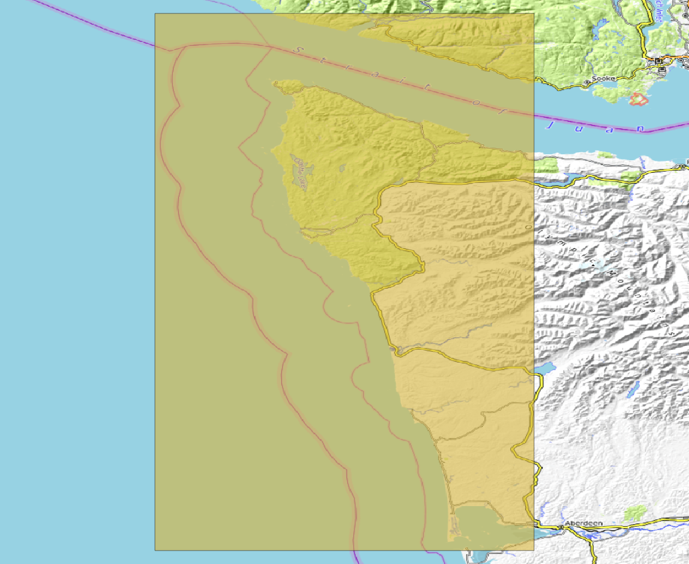
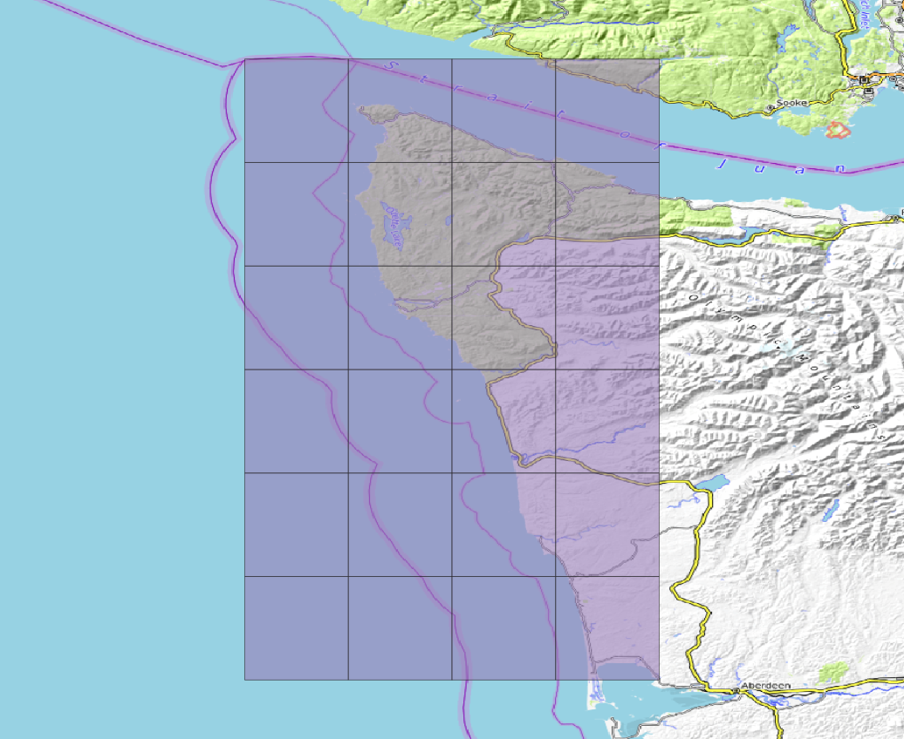
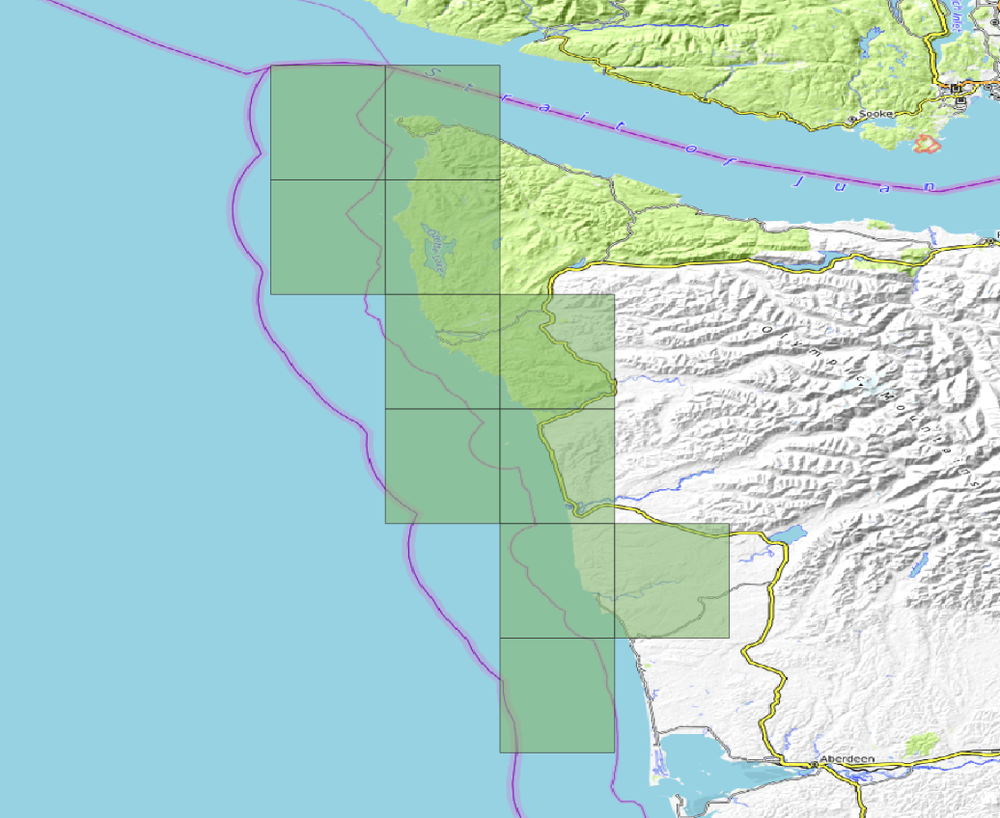
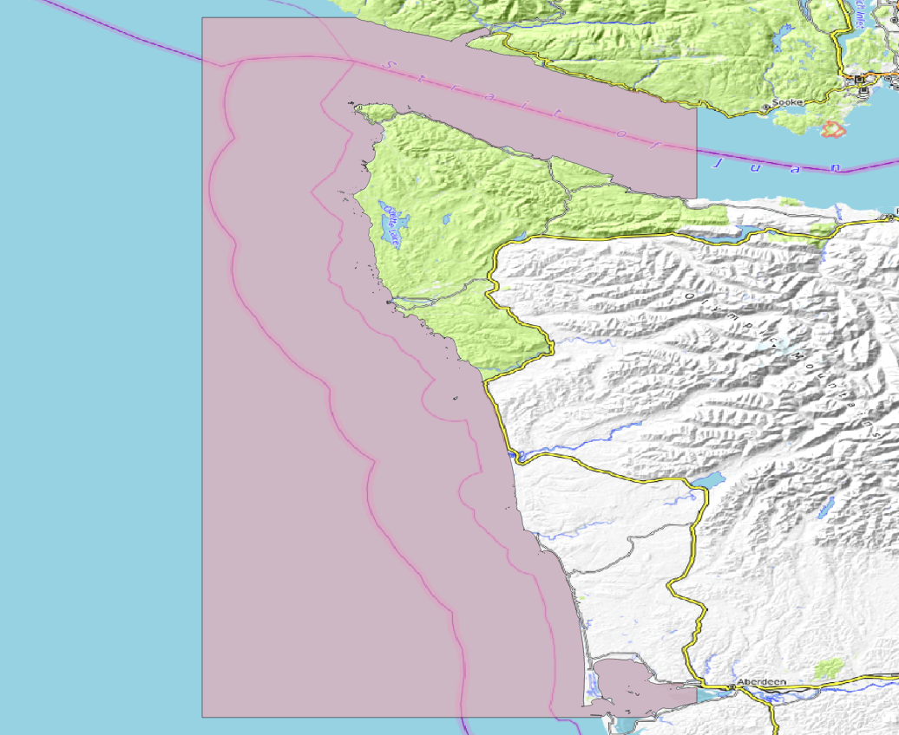

# Overview

DEM generation example of Northern Washington.

## Specifications

| Region | Tile-Size | Cell-size | Horz Projection | Vert Projection |
|---|---|---|---|---|
| -R-125/-124/47/48.5 | .25 degrees | 1/9 Arc-Second (~3m) | NAD83 | NAVD88 |


## Generate the region vectors

### Generate a full-region buffered vector

This is for data fetching, etc.

Add a slight buffer (.1 degree) to ensure coverage of fetched data.

```bash
regions -R -125/-124/47/48.5 -B .1
```

Outputs: [region_n48x60_w125x10.shp](region_n48x60_w125x10.geojson)



### Generate the .25 degree tiles

these will be the extents of each DEM generated.

```regions -R -121/-114/31.5/35 -T .25```

Outputs: [regions_tile_set.shp](regions_tile_set.geojson) with 24 .25 degree tiles.



### Edit the tile set to only include desired tiles (using a GIS)

[tiles_1_9.shp](tiles_1_9.geojson)



## Generate a Coastline vector (optional)

```bash
fetch_osm_coastline.py -R region_n48x60_w125x10.geojson wa_coast.shp
```
Outputs: [wa_coast.shp](wa_coast.geojson)



## Fetch common datasets

Use the [fetches](/docs/fetches.md) command to download common datasets. Use the `-H` switch to fetch data in multiple threads. The fetched data will be located in the current working directory in a directory named after the fetch module.

### Bathymetry
#### HydroNOS

```bash
fetches -R tiles_1_9.shp hydronos -H3
```

#### Nautical Charts
```bash
fetches -R tiles_1_9.shp charts -H3
```

#### Multibeam
```bash
fetches -R tiles_1_9.shp multibeam -H3
```

#### Crowd-Sourced Bathymetry
```bash
fetches -R tiles_1_9.shp csb -H3
```

### Topography / Near-shore Bathymetry

#### Digital Coast Lidar
```bash
fetches -R tiles_1_9.shp digital_coast:datatype=lidar -H3
```

#### USGS Lidar

#### USGS DEMs

#### CUDEMs
```bash
fetches -R tiles_1_9.shp CUDEM -H3
```

## Make a datalist

- see fetches --help for available datasets, or gather and use your own data.

## Generate a test tile

pick a tile and generate an on-the-fly DEM to see what it looks like

either, use the region dimensions of the desired tile or select and export the tile to a new vector using a GIS.

