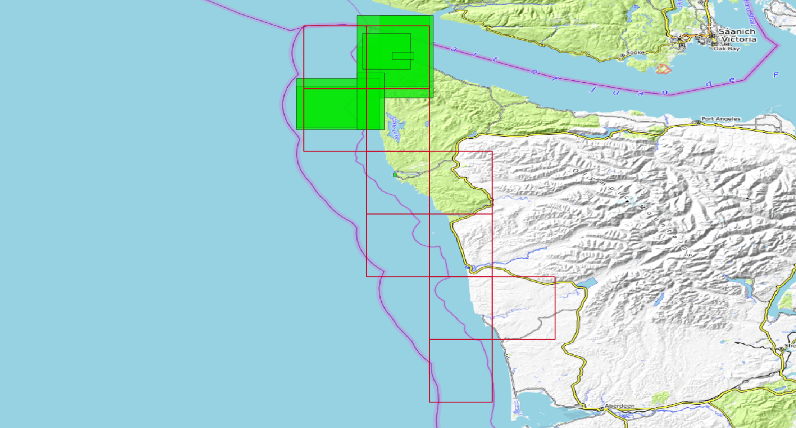

# Overview

DEM generation example of Northern Washington.

## Specifications

| Region | Tile-Size | Cell-size | Horz Projection | Vert Projection |
|---|---|---|---|---|
| -R-125/-124/47/48.5 | .25 degrees | 1/9 Arc-Second (~3m) | NAD83 | NAVD88 |


## Generate the region vectors

### Generate a full-region buffered vector

This is for data fetching, etc.

Add a slight buffer (.1 degree) to ensure coverage of fetched data.

```bash
regions -R -125/-124/47/48.5 -B .1
```

Outputs: [region_n48x60_w125x10.shp](region_n48x60_w125x10.geojson)


### Generate the .25 degree tiles

these will be the extents of each DEM generated.

```regions -R -121/-114/31.5/35 -T .25```

Outputs: [regions_tile_set.shp](regions_tile_set.geojson) with 24 .25 degree tiles.


### Edit the tile set to only include desired tiles (using a GIS)

[tiles_1_9.shp](tiles_1_9.geojson)


## Generate a Coastline vector (optional)

```bash
fetch_osm_coastline.py -R region_n48x60_w125x10.geojson wa_coast.shp
```
Outputs: [wa_coast.shp](wa_coast.geojson)


## Fetch common datasets and create datalists

Use the [fetches](/docs/fetches.md) command to download common datasets. Use the `-H` switch to fetch data in multiple threads. The fetched data will be located in the current working directory in a directory named after the fetch module. Using the tiled vector file generated above, `tiles_1_9.shp`, we will fetch data for each of the tiles, adding a 25% buffer to each tile. The data won't be duplicated, so a file fetched for one tile will be skipped if it's present in other tile.

Fetched data can then be either processed to XYZ or used as-is in a datalist. Data originating in raster or las/z format will be used as-is, while some other datasets will be processed to XYZ and common datums for use in the datalists.

### Bathymetry
#### HydroNOS

```bash
fetches -R tiles_1_9.shp:pct_buffer=25 hydronos -H3
```

Process the fetched data to XYZ and NAD83/NAVD88
```bash
dlim -R ../software/tiles_1_9.shp:pct_buffer=25 -P epsg:4269+5703 hydronos --archive hydronos
```

This will generate a datalist and associated auxilary files:
```
hydronos.datalist  hydronos.datalist.inf  hydronos.datalist.json
```


#### Nautical Charts
```bash
fetches -R tiles_1_9.shp:pct_buffer=25 charts -H3
```

Process the fetched data to XYZ and NAD83/NAVD88
```bash
dlim -R tiles_1_9.shp:pct_buffer=25 -P epsg:4269+5703 charts --archive charts
```

This will generate a datalist and associated auxilary files:
```
charts.datalist  charts.datalist.inf  charts.datalist.json
```



#### Multibeam
```bash
fetches -R tiles_1_9.shp:pct_buffer=25 multibeam -H3
```

Process the fetched data to XYZ and NAD83, leaving the vertical datum as 'Instantaneous Mean Sea Level', include the -w and -u switches to include weights and uncertainty, respectively.
```bash
dlim -R ../software/tiles_1_9.shp:pct_buffer=25 multibeam -u -w -P epsg:4269 --archive multibeam
```

We can also keep the multibeam data as-is to save space and process them directly from a datalist:

```bash
cd multibeam
for i in */; do cd $i; dlim -g > $(basename $i).datalist; dlim -i $(basename $i).datalist; cd ..; done
find ./multibeam/ -type f | grep datalist | grep -v json | grep -v inf | awk '{print $1, -1, 1, 0}' > multibeam.datalist
dlim -i multibeam.datalist
```

Either of these will generate a datalist and associated auxilary files:
```
multibeam.datalist  multibeam.datalist.inf  multibeam.datalist.json
```


#### EHydro
```bash
fetches -R tiles_1_9.shp ehydro -H3
```

Process the fetched data to XYZ and NAD83/NAVD88, include the extraction of the contours.
```bash
dlim -R ../software/tiles_1_9.shp:pct_buffer=25 ehydro,-203:want_contours=True -P epsg:4269+5703 --archive ehydro
```

This will generate a datalist and associated auxilary files:
```
ehydro.datalist  ehydro.datalist.inf  ehydro.datalist.json
```


#### Crowd-Sourced Bathymetry
```bash
fetches -R tiles_1_9.shp:pct_buffer=25 csb -H3
```

Process the fetched data to XYZ and NAD83/NAVD88.
```bash
dlim -R ../software/tiles_1_9.shp:pct_buffer=25 csb -P epsg:4269+5703 --archive csb
```

This will generate a datalist and associated auxilary files:
```
csb.datalist  csb.datalist.inf  csb.datalist.json
```


### Topography / Near-shore Bathymetry

#### Digital Coast Lidar

There is a lot of data on the Digital Coast Access Viewer, we don't necessarily need it all. Running the following command will fetch all the available lidar in the AOI and unless you have a lot of disk space, it may fill up and fail at some point. You can search and discover the survey ID for desired lidar surveys using the [DAV](https://coast.noaa.gov/dataviewer/#/lidar/search/-13932941.515821926,5948023.793039274,-13788628.406419514,6198737.245814653).

```bash
fetches -R tiles_1_9.shp digital_coast:datatype=lidar -H3
```

Otherwise, we can determine which surveys we want specifically and fetch them using the ':where="ID=<survey-ID>"' option in the digital_coast fetches module. We can either run a command for each survey ID we want, or string multiple together with 'OR': ':where="ID=<ID1> OR ID=<ID2> ..."'

```bash
fetches -R tiles_1_9.shp digital_coast:where="ID=9703 OR ID=" -H3
```

We can also gather lidar surveys by date, if we want to just use lidar since 2018, for example, we can do:

```bash
fetches -R tiles_1_9.shp digital_coast:datatype=lidar:where="YEAR>2017" -H3
```

See `fetches --modules digital_coast` to see all the possible query fields.

For this example, we'll fetch specific lidar surveys, with the following command:

```bash
fetches -R tiles_1_9.shp:pct_buffer=25 digital_coast:where="ID=9703 OR ID=10116 OR ID=9072 OR ID=9512 OR ID=4989 OR ID=6263 OR ID=5008 OR ID=2492 OR ID=2508 OR ID=2603 OR ID=8607 OR ID=2584 OR ID=2482" -H3
```

We will leave these files as they are, laz formatted lidar, and generate a datalist of the results.

```bash
cd digital_coast
for i in */; do cd $i; dlim -g > $(basename $i).datalist; dlim -i $(basename $i).datalist; cd ..; done
cd ..
find ./digital_coast/ -type f | grep datalist | grep -v json | grep -v inf | awk '{print $1, -1, 1, 0}' > digital_coast.datalist
dlim -i digital_coast.datalist
```

This will generate a datalist and associated auxilary files:
```
digital_coast.datalist  digital_coast.datalist.inf  digital_coast.datalist.json
```


#### USGS Lidar

#### USGS DEMs

##### National Elevation Dataset 1 meter DEMs

```bash
fetches -R tiles_1_9.shp:pct_buffer=25 ned1
```

We will leave these files as they are, GeoTiff rasters and generate a datalist of the results. Since these data come in UTM Zone 10 North, we will assign that srs to the datalist for proper transformation and location when processing. We'll add the format-specific option of 'remove_flat=True' into the datalist to remove the hydro-flattened areas of the raster.

```bash
cd tnm
dlim -g | awk '{print $1,$2":remove_flat=True",$3,$4}' > ned1.datalist
dlim -i ned1.datalist -J epsg:26910
cd ..
ls tnm/*.datalist | awk '{print $1,-1,1,0}' > ned1.datalist
dlim -i ned1.datalist -J epsg:26910
```

This will generate a datalist and associated auxilary files:
```
ned1.datalist  ned1.datalist.inf  ned1.datalist.json
```


##### Coastal National Elevation Dataset (CoNED)

```bash
fetches -R tiles_1_9.shp:pct_buffer=25 CoNED
```

#### CUDEMs
```bash
fetches -R tiles_1_9.shp:pct_buffer=25 CUDEM -H3
```

We will leave these files as they are, GeoTiff rasters and generate a datalist of the results. We may or may not use these data in the final gridding, but they can useful as a basis to compare to for data collection and processing.

```bash
cd CUDEM
for i in */; do cd $i; dlim -g > $(basename $i).datalist; dlim -i $(basename $i).datalist; cd ..; done
cd ..
find ./CUDEM/ -type f | grep datalist | grep -v json | grep -v inf | awk '{print $1, -1, 1, 0}' > CUDEM.datalist
dlim -i CUDEM.datalist
```

This will generate a datalist and associated auxilary files:
```
CUDEM.datalist  CUDEM.datalist.inf  CUDEM.datalist.json
```


## Make a main datalist

Combine all the previously made datalists, located in ${base}/data to a main datalist in ${base}/software and generate auxilary files, specifying a target horizontal datum of NAD83.
```bash
ls ../data/*.datalist | awk '{print $1,-1,1,0}' > northern_wa.datalist
dlim -i northern_wa.datalist -P epsg:4269
```

This will generate a datalist and associated auxilary files:
```
northern_wa.datalist  northern_wa.datalist.inf  northern.datalist.json
```

The contents of this datalist should point to the previously made datalists, we can comment out the CUDEM and CoNED datalists for now:
```
../data/charts.datalist -1 1 0
../data/csb.datalist -1 1 0
../data/digital_coast.datalist -1 1 0
../data/ehydro.datalist -1 1 0
../data/hydronos.datalist -1 1 0
../data/multibeam.datalist -1 1 0
../data/ned1.datalist -1 1 0
../data/waDNR.datalist -1 1 0
#../data/CoNED.datalist -1 1 0
#../data/CUDEM.datalist -1 1 0
```

## Generate a test tile

pick a tile and generate an on-the-fly DEM to see what it looks like

either, use the region dimensions of the desired tile or select and export the tile to a new vector using a GIS.

