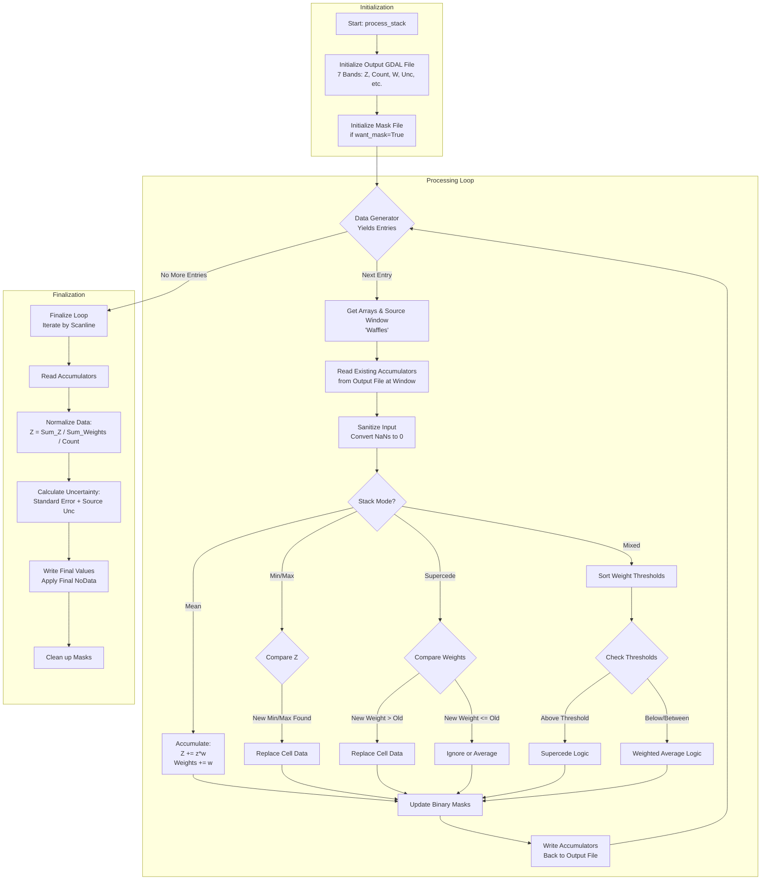

```mermaid
flowchart TD
    subgraph Initialization
    A[Start: process_stack] --> B[Initialize Output GDAL File<br/>7 Bands: Z, Count, W, Unc, etc.]
    B --> C[Initialize Mask File<br/>if want_mask=True]
    end

    subgraph Processing Loop
    C --> D{Data Generator<br/>Yields Entries}
    D -- Next Entry --> E[Get Arrays & Source Window<br/>'Waffles']
    E --> F[Read Existing Accumulators<br/>from Output File at Window]
    F --> G[Sanitize Input<br/>Convert NaNs to 0]
    
    G --> H{Stack Mode?}
    
    H -- Mean --> I[Accumulate:<br/>Z += z*w<br/>Weights += w]
    
    H -- Min/Max --> J{Compare Z}
    J -- New Min/Max Found --> K[Replace Cell Data]
    
    H -- Supercede --> L{Compare Weights}
    L -- New Weight > Old --> M[Replace Cell Data]
    L -- New Weight <= Old --> N[Ignore or Average]
    
    H -- Mixed --> O[Sort Weight Thresholds]
    O --> P{Check Thresholds}
    P -- Above Threshold --> Q[Supercede Logic]
    P -- Below/Between --> R[Weighted Average Logic]
    
    I --> S[Update Binary Masks]
    K --> S
    M --> S
    N --> S
    Q --> S
    R --> S
    
    S --> T[Write Accumulators<br/>Back to Output File]
    T --> D
    end

    subgraph Finalization
    D -- No More Entries --> U[Finalize Loop<br/>Iterate by Scanline]
    U --> V[Read Accumulators]
    V --> W[Normalize Data:<br/>Z = Sum_Z / Sum_Weights / Count]
    W --> X[Calculate Uncertainty:<br/>Standard Error + Source Unc]
    X --> Y[Write Final Values<br/>Apply Final NoData]
    Y --> Z[Clean up Masks]
    end
```	