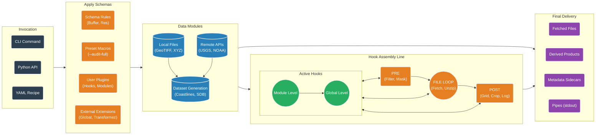

```mermaid
flowchart LR
    %% Custom Styling
    classDef input fill:#2c3e50,stroke:#ecf0f1,stroke-width:2px,color:#fff,rx:5px,ry:5px;
    classDef engine fill:#e67e22,stroke:#ecf0f1,stroke-width:2px,color:#fff,rx:5px,ry:5px;
    classDef module fill:#2980b9,stroke:#ecf0f1,stroke-width:2px,color:#fff,rx:5px,ry:5px;
    classDef hook fill:#27ae60,stroke:#ecf0f1,stroke-width:2px,color:#fff,rx:5px,ry:5px;
    classDef output fill:#8e44ad,stroke:#ecf0f1,stroke-width:2px,color:#fff,rx:5px,ry:5px;

    %% 1. Inputs
    subgraph Inputs ["Invocation"]
        direction LR
        CLI("CLI Command"):::input
        API("Python API"):::input
        Recipe("YAML Recipe"):::input
    end

    %% 2. Orchestration
    subgraph Schemas ["Apply Schemas"]
        direction LR
        Schema("Schema Rules<br/>(Buffer, Res)"):::engine
        Presets("Preset Macros<br/>(--audit-full)"):::engine
		Plugins("User Plugins<br/>(Hooks, Modules)"):::engine
        Extensions("External Extensions<br/>(Globat, Transformez)"):::engine
    end

    %% 3. Data Sources
    subgraph Sources ["Data Modules"]
        direction TB
        Remote[("Remote APIs<br/>(USGS, NOAA)")]:::module
        Local[("Local Files<br/>(GeoTIFF, XYZ)")]:::module
        Tools[("Dataset Generation<br/>(Coastlines, SDB)")]:::module

        Local --> Tools
        Remote --> Tools
    end

    %% 4. The Pipeline
    subgraph Pipeline ["Hook Assembly Line"]
        direction LR

        subgraph HookTypes ["Active Hooks"]
            direction LR
            ModHooks(("Module Level")):::hook
            GlobHooks(("Global Level")):::hook
            ModHooks --> GlobHooks
        end

        Pre("PRE<br/>(Filter, Mask)"):::engine
        File(("FILE LOOP<br/>(Fetch, Unzip)")):::engine
        Post("POST<br/>(Grid, Crop, Log)"):::engine

        Pre --> File --> Post

        HookTypes ~~~ Pre
        Pre <--> HookTypes
        File <--> HookTypes
        Post <--> HookTypes
    end

    %% 5. Outputs
    subgraph Out ["Final Delivery"]
        direction LR
        Files("Fetched Files"):::output
        Products("Derived Products"):::output
        Metadata("Metadata Sidecars"):::output
        Pipes("Pipes (stdout)"):::output
    end

    %% Connections
    Inputs --> Schemas
    Schemas --> Sources
    Sources --> Pipeline
    Sources --> Out
    Pipeline --> Out
```
